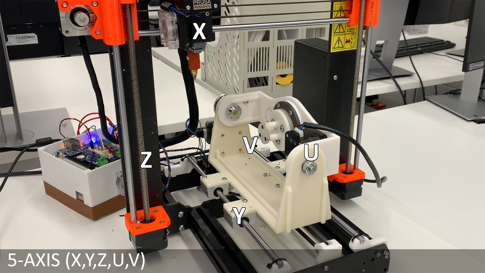

# 5-axis 3D printer

This is a github repository for Open5x: 5-axis 3D printer

This Github repository contains detailed research material of the published CHI 2021 conference paper titled "Open5x: Accessible 5-axis 3D printing and conformal slicing"

Research mateiral shared in this repository include:

1. Materials and supplier list

2. 3D printing files for assembly

3. Settings for 3D printer electronics board (Duet2 + RepRap firmware 3.1.1)

4. Instructions for hardware assemnbly

5. Grasshopper definition and Rhino template for 5-axis Slicing.

Link to the video:

https://youtu.be/x9rG15qrDIE
