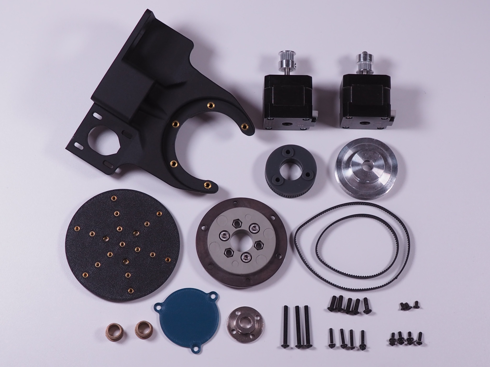

# Introduction

Democratising 5-axis 3D printer

At present, many people are unable to access 5-axis 3D printing due to the unavailability of hardware and software for personal use. Commercial multi-axis CNC machines and robotic arms are not designed specifically for additive manufacturing, and their firmware does not support standard 3D printing functions. Moreover, even the most affordable 5-axis machine still costs more than $9,945, which makes it prohibitively expensive for personal use. 

On the other hand, community engagement has been the primary driving force behind the widespread adoption of 3D printing in various industries. Through collaborative development, 3D printers have become more affordable, functional, and user-friendly. Similarly, 5-axis 3D printing could also benefit from the open-source community to accelerate its development and growth.

Open5x is a project that draws inspiration from open-source machines for personal fabrication. The project demonstrates how a popular off-the-shelf 3-axis 3D printer can be upgraded to 5-axis 3D printing, enabling more independent makers to take advantage of the benefits of conformal 3D printing.

# Update

The most recent iteration of the open5x has been implmented on E3D's toolchanger by @Brendonbuild. Stp files for design can be found in this repository.

Please check out #open5x, especially @Brendonbuild 's work on open5x on twitter!
There is also ongoing development of free to employ non-planar and 5-axis G-code producer called fullcontrol.xyz by Andy Gleadall

Research material shared in this repository include:

1. Materials and supplier list

2. 3D printing files for assembly

3. Settings for 3D printer electronics board (Duet2 + RepRap firmware 3.1.1)

4. Instructions for hardware assembly

5. Grasshopper definition and Rhino template for 5-axis Slicing.

Link to the video:
https://youtu.be/x9rG15qrDIE

[More information](3D_Model/E3D_ToolChanger/README.md)

--------

This is an on-going project repo for Open5x
The next iteration of open5x will include:

Hardware:
1. Auto-levelling the tilt on U-axis (so the printing bed is perfectly in parallel with the X-axis) currently this is achieved through digital sprit level + manual G92 U0
2. Part cooling fan will be re-designed so that air is blown on to the end of the long nozzle but without reducing the contact angle.
3. Endstop on Z-axis to avoid manual bed levelling.

Software:
1. Grasshopper definition is going through series of iteration to reduce the computing time of slicing.
2. There are still few remaining errors in the current version which is being worked on.
3. Eventually we would aim to have stand-alone opensource slicer for 5-axis.

-------

Full length article can be found in below:
https://arxiv.org/abs/2202.11426

Link to the videos:
https://www.youtube.com/watch?v=C3vKHuxUmjc&list=PLSqgj9-nhHAx7sJzOzrpPwBRhMIwGWn0z&index=4

## License
The contents of this repository is under an MIT License, see [LICENSE.md](https://github.com/FreddieHong19/Open5x/blob/main/LICENSE) for more details.
